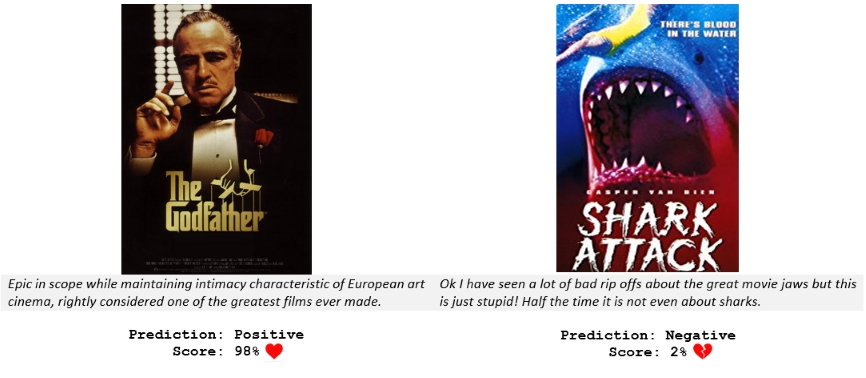

# sentiment-analysis-template

[Sentiment analysis](https://en.wikipedia.org/wiki/Sentiment_analysis) is one of the most common [NLP](https://en.wikipedia.org/wiki/Natural-language_processing) problems. The goal is to analyze a text and predict whether the underlying sentiment is positive, negative or neutral. 
*What can you use it for?* Here are a few ideas - measure sentiment of customer support tickets, survey responses, social media, and movie reviews! 

### Predicting sentiment of movie reviews

In this notebook we will build a [Convolutional Neural Network](http://www.wildml.com/2015/11/understanding-convolutional-neural-networks-for-nlp/) (CNN) classifier to predict the sentiment (positive or negative) of movie reviews. 

We will use the [Stanford Large Movie Reviews](http://ai.stanford.edu/~amaas/data/sentiment/) dataset for training our model. The dataset is compiled from a collection of 50,000 reviews from IMDB. It contains an equal number of positive and negative reviews. The authors considered only highly polarized reviews. Negative reviews have scores ≤ 4 (out of 10), while positive reviews have score ≥ 7. Neutral reviews are not included. The dataset is divided evenly into training and test sets.

We will:
- Preprocess text data for NLP
- Build and train a 1-D CNN using Keras and Tensorflow
- Evaluate our model on the test set
- Run the model on your own movie reviews!
